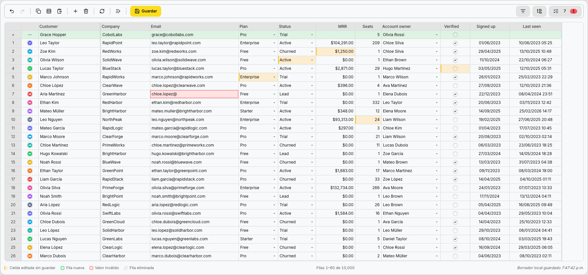
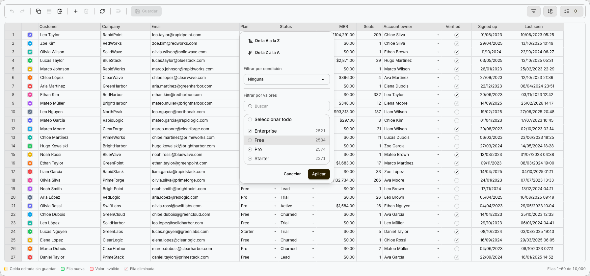
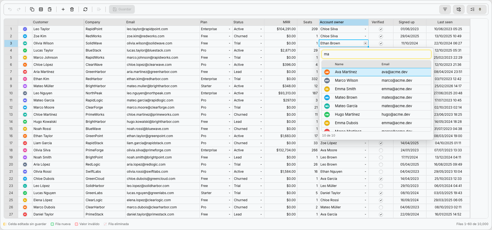
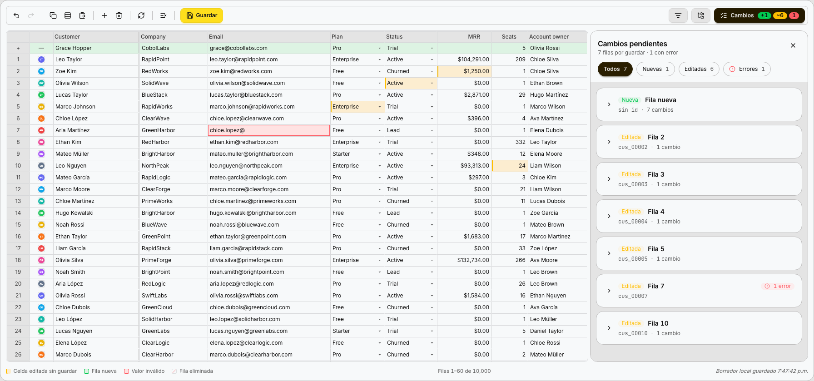
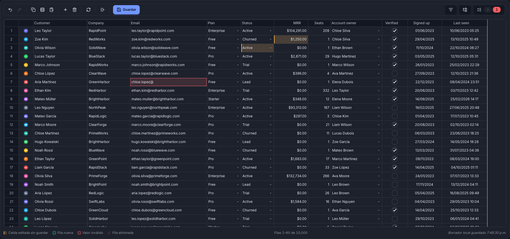

<div align="center">

# SpreadBase

**Your database, as a spreadsheet.**

A Svelte 5 spreadsheet and an Express backend that turn any table into a fast, editable grid —<br>
with validation, undo/redo, batch saves and conflict detection built in.

[](https://www.npmjs.com/package/@spreadbase/client)
[](https://www.npmjs.com/package/@spreadbase/server)
[](LICENSE)
[](https://svelte.dev)
[](https://www.typescriptlang.org)



</div>

## Why SpreadBase

Admin panels and back offices keep rebuilding the same table: load rows, edit them, validate, save, and hope two people didn't edit the same record. SpreadBase gives you that table as a spreadsheet your team already knows how to use, and keeps the hard parts on the server.

- **Define the sheet once, on the server.** Columns, types and rules live in one place. The client asks for the schema and renders it.
- **Large tables, small pages.** The grid holds a window of rows and fetches pages as you scroll. 50,000 rows feel like 50.
- **Edit like a spreadsheet.** Type, paste ranges from Excel, fill down, undo and redo. Nothing is sent until you hit **Save**.
- **Safe saves.** Changes travel as one batch, validated by the server. If someone else changed the same field, you get a conflict instead of a silent overwrite.
- **Never lose work.** Unsaved edits are kept in the browser and restored after a reload.
- **Postgres-ready.** Point it at a table or a view, or plug in your own service logic in a single transaction.

## Quick start

### 1. Install

```bash
# backend
npm install @spreadbase/server express cors

# frontend (Svelte 5 + Tailwind CSS 4 + daisyUI 5)
npm install @spreadbase/client
```

### 2. Define a sheet on the server

```ts
// server.ts
import express from 'express';
import cors from 'cors';
import { SpreadBase, memorySource, sheetRouter, types } from '@spreadbase/server';

const customers = new SpreadBase({
  id: 'customers',
  allowInsert: true,
  allowDelete: true,
  columns: {
    name:   { type: types.TEXT,   label: 'Customer', required: true },
    email:  { type: types.TEXT,   label: 'Email', pattern: '^[^@\\s]+@[^@\\s]+$' },
    plan:   {
      type: types.SELECT,
      label: 'Plan',
      options: [
        { value: 'free', label: 'Free' },
        { value: 'pro', label: 'Pro' }
      ]
    },
    mrr:    { type: types.NUMBER, label: 'MRR', prefix: '$', precision: 2, thousands: true },
    since:  { type: types.DATE,   label: 'Customer since' }
  },
  source: memorySource({
    rows: [
      { id: '1', name: 'Ada Lovelace', email: 'ada@example.com', plan: 'pro', mrr: 99, since: '2024-03-01' },
      { id: '2', name: 'Alan Turing', email: 'alan@example.com', plan: 'free', mrr: 0, since: '2025-01-15' }
    ]
  })
});

const app = express();
app.use(cors());
app.use('/api/customers', sheetRouter(customers));
app.listen(4000, () => console.log('SpreadBase on http://localhost:4000/api/customers'));
```

`sheetRouter` mounts the whole protocol: schema, paged rows, batch save and lookups.

### 3. Render it in Svelte

```svelte
<!-- Customers.svelte -->
<script lang="ts">
  import { Sheet, SpreadBase } from '@spreadbase/client';

  const sheet = new Sheet('http://localhost:4000/api/customers');
</script>

<div style="height: 600px">
  <SpreadBase {sheet} fill />
</div>
```

Let Tailwind see the component classes, and load the theme once:

```css
/* app.css */
@import 'tailwindcss';
@plugin 'daisyui';
@source '../node_modules/@spreadbase/client';
```

```ts
// +layout.svelte (or your entry file)
import '@spreadbase/client/theme-daisyui.css';
```

That's it: a sortable, filterable, editable grid with validation and batch saves.

## Features

### Every column type you need

| Type | Stores | In the cell |
|---|---|---|
| `TEXT` | text | Plain text, with `required`, `minLength`, `maxLength` and `pattern` |
| `NUMBER` | number | `prefix`, `suffix`, `precision`, `thousands`; `min` and `max` |
| `SELECT` | one of `options` | The label, with a searchable list |
| `LOOKUP` | an id from another table | The record's name, with a paged mini table to pick from |
| `DATE` / `DATETIME` | `YYYY-MM-DD` / `YYYY-MM-DD HH:mm` | A calendar, with time for `DATETIME` |
| `BOOLEAN` | `true` / `false` | A checkbox that toggles with one click |
| `IMAGE` | a URL | A thumbnail, or a round avatar with `shape: 'round'` |
| `FILE` | an uploaded file | A link; upload by drag and drop |
| `PASSWORD` | a hash, never sent back | `••••••••` |

Every rule you declare is checked twice: in the browser while you type, and again on the server before anything is written.

### Excel-like sorting and filtering

Each header opens a menu to sort, filter by condition or pick values, with counts computed by the server over the whole table, not just the loaded page. A side panel combines filters, and another groups rows.



### Lookups into other tables

A `LOOKUP` column stores an id and shows a name. Editing opens a searchable, paged mini table, so it works with thousands of records.

```ts
owner_id: {
  type: types.LOOKUP,
  label: 'Account owner',
  lookup: {
    value: 'id',
    display: 'name',
    columns: {
      avatar: { type: types.IMAGE, label: '', shape: 'round' },
      name:   { type: types.TEXT,  label: 'Name' },
      email:  { type: types.TEXT,  label: 'Email' }
    },
    search: (q, { offset, limit }) => users.search(q, offset, limit), // → { rows, total }
    byIds:  (ids) => users.findByIds(ids)                              // → rows
  }
}
```



### Review before you save

Edited cells turn yellow, new rows green and invalid values red. The changes panel lists every pending row and its errors, and **Save** sends them all in one batch. If another user changed the same field in the meantime, that field comes back as a conflict for you to resolve.



### Light and dark, from your daisyUI theme

The grid reads its colors from your daisyUI tokens, so it follows any theme your app uses.



### Postgres in production

Swap `memorySource` for `postgresSource`. It reads from a table or a view, locks rows during the save and writes in a single transaction.

```ts
import pg from 'pg';
import { SpreadBase, postgresSource, types } from '@spreadbase/server';

const pool = new pg.Pool({ connectionString: process.env.DATABASE_URL });

const products = new SpreadBase({
  id: 'products',
  columns: { /* … */ },
  source: postgresSource({
    pool,
    table: 'products',          // locked and written on save
    view: 'products_active',    // optional: what the sheet reads
    versionColumn: 'updated_at' // optional: otherwise a hash of the row is used
  })
});
```

When writes need business rules (price history, soft deletes, side effects), add **handlers**. They run inside the same transaction, with its connection:

```ts
new SpreadBase({
  id: 'products',
  columns,
  source: postgresSource({ pool, table: 'products' }),
  handlers: {
    insertMany: (items, { tx }) => service.create(items, tx),
    updateMany: (items, { tx }) => service.update(items, tx),
    deleteMany: (items, { tx }) => service.archive(items, tx)
  }
});
```

### Tune the grid on the client

The server owns the data; the screen is yours. Override columns, add row actions and your own toolbar buttons, or pin a filter:

```ts
const sheet = new Sheet('/api/customers', {
  columns: {
    name: { width: 260 },                                   // patch a server column
    plan: (col) => ({ ...col, label: 'Subscription' }),     // or rewrite it
    notes: { type: 'text', label: 'Notes', at: 'end' }      // client-only column
  },
  actions: [{ label: 'Open', icon: ExternalLink, onclick: (row) => goto(`/customers/${row.id}`) }],
  filters: { plan: 'pro' },                                 // a fixed filter
  frozenColumns: 1
});
```

```svelte
<SpreadBase
  {sheet}
  fill
  toolbar={{ actions: [{ label: 'Invite', icon: UserPlus, onclick: invite }] }}
/>
```

### Forms with the same rules

`Field` and `FormState` render a single record with the same editors and validation as the grid's cells. `RecordForm` edits an existing row and saves only what changed.

```svelte
<script lang="ts">
  import { Field, FormState, Sheet } from '@spreadbase/client';

  const form = new FormState(new Sheet('/api/customers'), { name: '', email: '', plan: 'free' });
</script>

<Field {form} name="name" />
<Field {form} name="email" />
<Field {form} name="plan" />
<button disabled={!form.valid}>Create</button>
```

### Import from Excel or CSV

`SheetImport` previews a file as an editable sheet, matches headers to columns by name or alias, lets the server check every row and applies the result.

### Test your sheets

`@spreadbase/testing` runs a contract against any sheet in your app, over HTTP, as two users: same-field conflicts, merges, deletes, idempotent retries and writes from other processes.

```ts
import { edit, sheetContract } from '@spreadbase/testing';

sheetContract({
  name: 'customers',
  url: 'http://localhost:4000/api/customers',
  reset: () => fetch('http://localhost:4000/dev/reset', { method: 'POST' }), // your seed endpoint
  edits: [edit.text('name'), edit.option('plan')]
});
```

## Packages

| Package | What it is |
|---|---|
| [`@spreadbase/server`](https://www.npmjs.com/package/@spreadbase/server) | The engine for Express: sheets, sources (memory, Postgres), validation, batch saves and the HTTP routes |
| [`@spreadbase/client`](https://www.npmjs.com/package/@spreadbase/client) | The Svelte 5 components: `SpreadBase`, `Sheet`, `Field`, `FormState`, `RecordForm`, `SheetImport` |
| [`@spreadbase/core`](https://www.npmjs.com/package/@spreadbase/core) | The shared contract: column types, rows, queries and errors. Installed with the other two |
| [`@spreadbase/testing`](https://www.npmjs.com/package/@spreadbase/testing) | The contract kit to test your sheets with Vitest |

## Try the playground

The repo ships one backend and one app with every example. The **Showcase** is the sheet in these screenshots: 10,000 customers in memory, every column type, no database needed.

```bash
git clone https://github.com/serchart/spreadbase.git
cd spreadbase
npm install
npm run back    # examples server → http://localhost:4100
npm run front   # examples app    → http://localhost:5180/showcase
```

| Example | What it shows |
|---|---|
| Showcase | Every column type over 10,000 rows |
| Basic | The minimum on each side, plus row actions and toolbar buttons |
| Postgres | A product catalog on Postgres with handlers and a lookup over 2,000 users |
| Cases | 50,000 rows in a layered module (routes → controller → service) |
| Form, Record | `Field`, `FormState` and `RecordForm` |
| Import | Excel and CSV import with server-side checks |
| Offline | A sheet with no server at all |

## Requirements

- **Server:** Node.js 20+ and Express 5. `pg` for Postgres.
- **Client:** Svelte 5, Tailwind CSS 4 and daisyUI 5.

## Status

SpreadBase is **0.x**: the API is settling and may change between minor versions. The grid's built-in labels are currently in Spanish; English and custom labels are next.

## License

[MIT](LICENSE) © [Sergio Iván López Retana](https://github.com/serchart)
